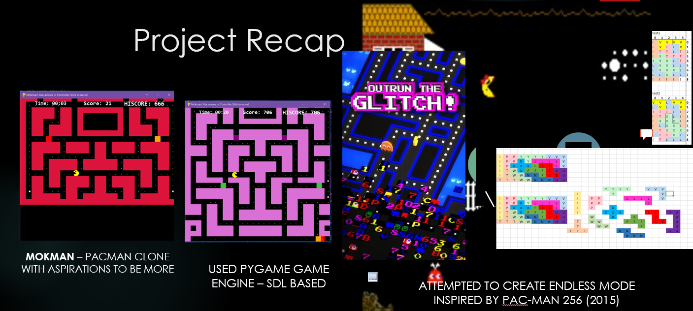

# ProjectMokman

# CS-4432 Game Project

[go to src code](https://github.com/riklauder/ProjectMokman/tree/master/src)

## Project Ten Page Plan 
Link to draft Ten Page Plan [Click Here!](https://1drv.ms/w/s!BC3kPYTrDe8AjeF9RJC0USLp8sFAeg?e=tSCDXQZf9E-M0kjkdhoAug&at=9)

**Living document will be updated until project end - Contains details of project design and lessons learned**

Map Analysis [Click Here](https://1drv.ms/x/s!Ai3kPYTrDe8Aj4QXeZNKA7SK2G1UnA?e=kCqbm4)
just some random analysis in Excel used to generate Map grids

Project Scedule and Story Planning [click here](https://1drv.ms/x/s!Ai3kPYTrDe8Aj4VHUD1C-X5nfQ5vfA?e=CYuuac)

## Project Description
Pacman Clone for undergrad game project. note: This project isn't entirely complete. May revisist when Pygame 2 is out of beta.

| Feature       | detail        | 
| ------------- |:-------------:| 
| Behaviours | Ghosts will have different behaviours and spawning patterns than OG game| 
| Maze Generation | Automatically generate random pacman style mazes |
| Endless Mode | Game plays single regenerating level that dynamically creates unique mazes with authentic Pacman style. Much better than using Eller type procedural generation which does not produce playable maps.  | 
| Power Ups | Power-ups - Typical power-pellets and continous food combo bonus(similar to pacman 256 )  |
| A-star search | Ghosts use A-star search in combination with behaviour attributes to obtain path to pacman
| Game Audio | Implemented instant player feedback and audio hints towards combo progress
  

## AIversion
[AIversion](https://github.com/riklauder/ProjectMokman/tree/master/AIversion)
Conatins Berkely Pacman AI project (modified to work with Python 3 and this project).  This framework was used for AI project last year.
This is the project that helped spark curiosity and project idea.

# design
[design](https://github.com/riklauder/ProjectMokman/tree/master/design)
contains design documents created in concept phase - pdf UML - created using combination of Pylint and Pyreverse
*Pylint can be installed with pip*

>pip install pylint

# ref
Contains reference code and documents collected from other sources
[ref](https://github.com/riklauder/ProjectMokman/tree/master/ref)

# src
[src](https://github.com/riklauder/ProjectMokman/tree/master/src)

**Main Source Code** for project - see additional **README** in [src](https://github.com/riklauder/ProjectMokman/tree/master/src) dir for more details and how to run

Built mostly in Python pygame but also used some JS and C++
To install pygame

>pip install pygame

*Also numpy may be required if not in your Python dist*

>pip install numpy

# Build/Play Instructions for Latest Build
*Generates random endless map consistent to OG Pacman and Ms Pacman level style*

*Will spawn Ghosts and Pacman Map, Food, Power Ups and Teleports*

1.  cd into src directory from Powershell or BASH

>cd src

2.  run ./mokman from that dir

>python mokman.py

**OR**

>./mokman

### creates random map for Pygame based game. Transformation of maps is done using C++ .

*mokman.sh or mokman.bat scripts will execute map transofrmation to create a new random map that is about 350 tiles high, then automatically start game using pygame.*
**MUST BE run from src dir**

*compiled C++ using WSL BASH shell in Windows with g++ although mapTransform.cpp could be compiled as mapt.exe using VS cl or other Windows c++ compiler 
*included a compiled mapTransform.exe and compiled mapt file in dir*

## Build/Play Instructions for prototype(**midterm presentation**)
*Generates random map consistent to OG Pacman and Ms Pacman level style*

*Will spawn Ghosts and Pacman using tkinter framework found in AIversion*

1.  cd into AIVersion

>cd AIversion

2.  run ./pacman from that dir

>./pacman

### creates random map for Python based game. Transformation of map strings using C++ .

*batch file will execute code then automatically start python game if run from correct dir

*requires WSL bash shell with g++ installed  

*working project and more details in README in [src](https://github.com/riklauder/ProjectMokman/tree/master/src) dir

Camera and Movement Controls Implementation
cd into src folder src
>cd src

>pytyhon pygamecam.py
